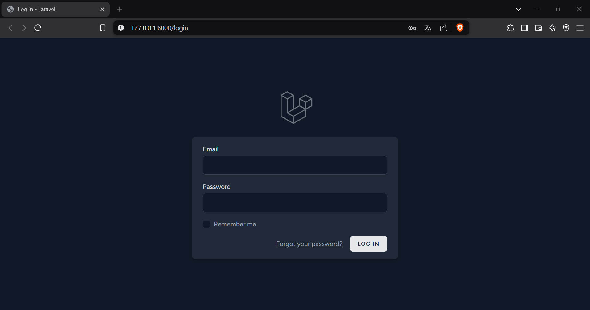
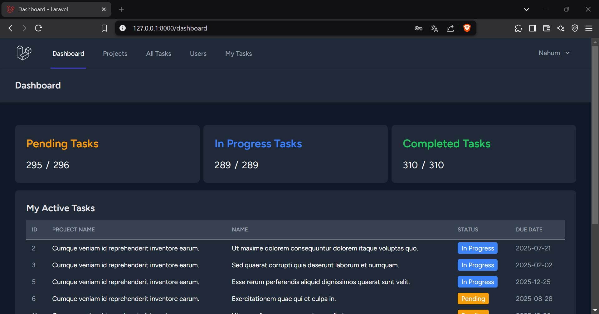
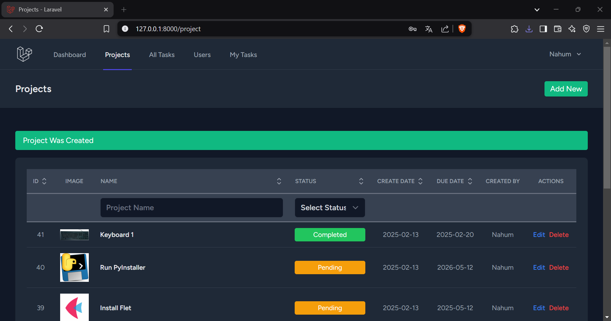
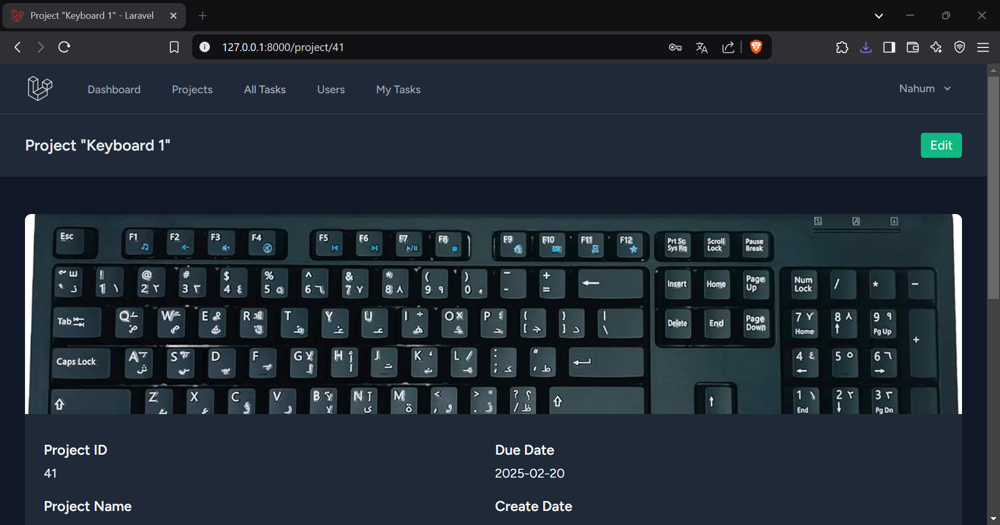
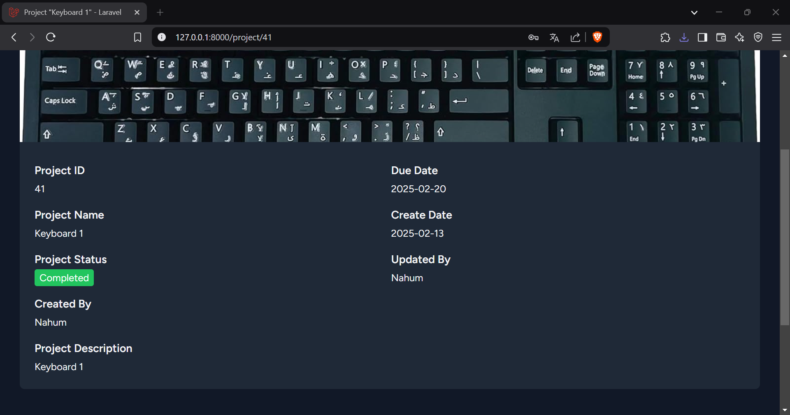
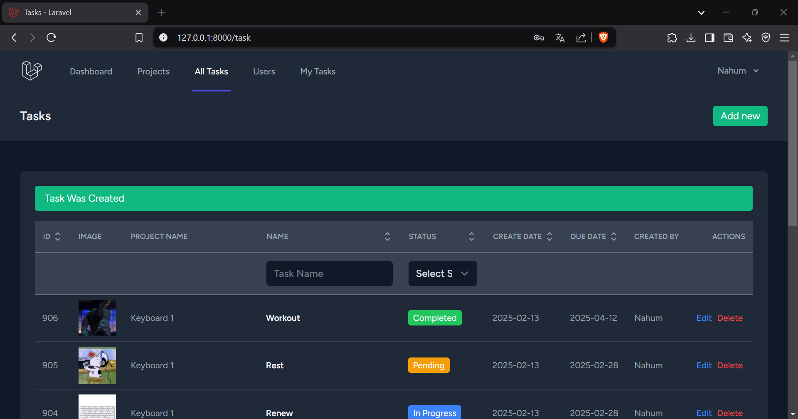
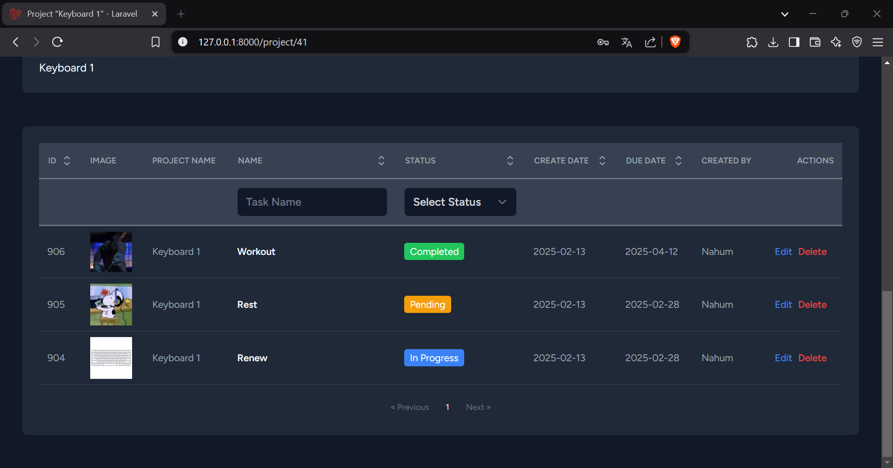
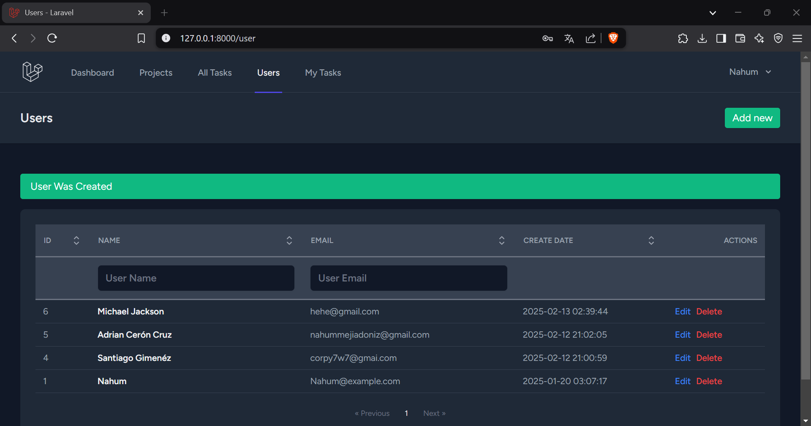
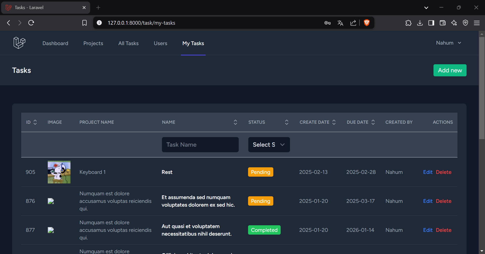

# Project Management


## Built With


## Features
- **Authentication System**: Secure login/logout for users.
- **Task Management**:
  - View tasks categorized as **Pending**, **In Progress**, and **Completed**.
  - Display personal task stats alongside global task stats.
- **Dashboard View**:
  - Clean and responsive dashboard layout with cards displaying key task metrics.
  - List of active tasks with real-time updates.
- **Dark Mode Support**: Optimized for both light and dark themes.
- **Responsive Design**: Fully functional across devices (desktop, tablet, and mobile).

## Prerequisites

Before setting up the project, ensure you have the following installed on your system:

- **PHP** (v8.0 or higher)
- **Composer** (Dependency Manager for PHP)
- **Node.js** (v14 or higher)
- **NPM**
- **MySQL** (or any other database supported by Laravel)

## Installation
1. Clone the repository
2. Install PHP dependencies: ```composer install```
3. Install Node.js dependencies: ```npm install```
4. Configure the .env file:
    - Copy .env.example to .env.
    - Set your database credentials and other environment variables.
5. Generate the application key: ```php artisan key:generate```
6. Run database migrations and seed the database: ```php artisan migrate --seed```
7. Start the local development server: ```php artisan serve```

## Usage
- Dashboard: Log in to access your personalized dashboard.
- Tasks: View task statuses, manage assignments, and check task details.
- Users: View, edit, delete, and manage all users.
- Projects: Monitor project statuses, manage projects, and view project details, including tasks assigned - to each project.

## Screenshots









